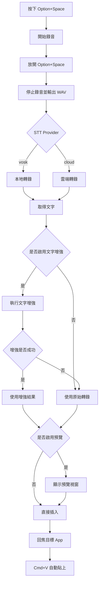
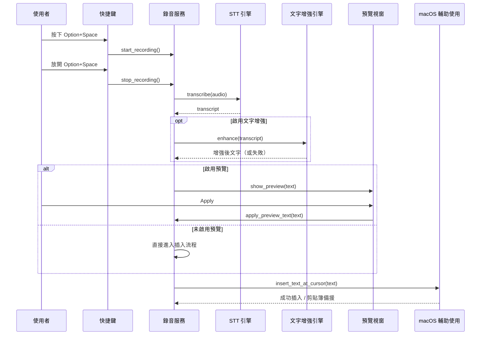

# Voxlore

Voxlore 是一款 macOS 桌面語音輸入工具。
按住快捷鍵說話、放開後轉錄，並自動回到目標 App 貼上文字。

English README: `README.md`

## 產品定位

- 輕量、可自架流程的 Typeless 類工具替代方案
- 支援本地與雲端語音辨識
- 優先優化繁體中文（台灣）與簡體中文、多語工作流
- 隱私優先：API Key 由使用者自行管理

## 主要功能

- 快捷鍵語音輸入（`Option+Space`）
- 可選擇插入前預覽
- 自動回焦目標 App 並貼上
- 文字增強（標點、格式、語句整理）
- 浮動小視窗顯示錄音與處理狀態
- 可調雲端逾時、除錯紀錄、右鍵 DevTools
- 語音 STT / 文字增強皆提供一鍵「測試連線」
- 請求層級除錯：`request_id`、HTTP 狀態碼、延遲時間

## Voice STT 支援

- `vosk`（本地離線）
- `openrouter`（預設）
- `openai_transcribe`
- `elevenlabs`
- `openai`
- `mistral`

### 預設值

- 預設 STT Provider：`openrouter`
- 預設 STT Model：`google/gemini-3-flash-preview`
- 預設文字增強模型：`google/gemini-3-flash-preview`

## 開發環境需求

| 依賴 | 版本 | 用途 |
|---|---|---|
| Rust | 1.75+ | Tauri 後端 |
| Node.js | 20+ | 前端工具鏈 |
| pnpm | 9+ | 套件管理 |
| Tauri CLI | 2.x | 桌面建置 |

## 本機開發與建置

```bash
# 安裝依賴
pnpm install

# 開發模式
pnpm tauri dev

# 正式建置
pnpm tauri build

# 僅打 DMG
pnpm tauri build --bundles dmg --verbose
```

## Debug Log

```bash
mkdir -p /tmp/voxlore-logs
/Applications/Voxlore.app/Contents/MacOS/voxlore 2>&1 | tee /tmp/voxlore-logs/run.log

rg -n "ui-debug|settings|recording|stt|text-insert|preview|enhancement|apikey|healthcheck|stt-http|enhancement-http" /tmp/voxlore-logs/run.log
```

### 連線測試與請求追蹤

- `Voice Provider` 與 `Text Enhancement` 區塊都有「測試連線」按鈕。
- 手動測試會驗證 endpoint + API key + model，並即時顯示成功/失敗 Toast。
- `run.log` 會輸出：
  - `healthcheck`：手動/定期健康檢查
  - `stt-http`：雲端 STT 請求追蹤
  - `enhancement-http`：文字增強請求追蹤

## 架構流程

### Flow Diagram



### Sequence Diagram



## 相關文件

- 英文主文件：`README.md`
- 版本異動：`CHANGELOG.md`
