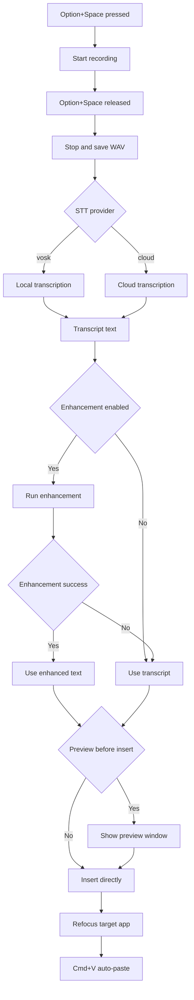
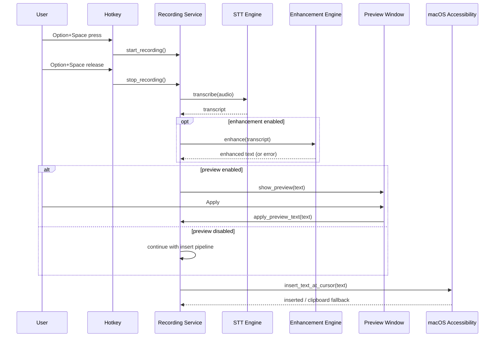

# Voxlore

Voxlore is a macOS voice-to-text desktop app.
Hold the shortcut, speak, release, and Voxlore transcribes then inserts text back into your target app.

中文文件請見：`Chinese.md`

## Positioning

- Lightweight typeless-style alternative with controllable pipeline
- Supports both local and cloud speech recognition
- Optimized for Traditional Chinese (Taiwan), Simplified Chinese, and multilingual workflows
- Privacy-first: API keys are managed by the user

## Messaging (Short / Long)

### Short

- **Understands intent, not just verbatim transcription.**
- **Reliable across tech, legal, and everyday language.**
- **Handles mixed Traditional Chinese + English and Taiwan-style loanword pronunciations (e.g., `baku` -> back / move backward).**

### Long

- **Intent-first output**: spoken thoughts are normalized into usable text, not raw word-by-word dumps.
- **Tech-language friendly**: preserves technical terms, English jargon, abbreviations, API names, and code-like tokens.
- **Legal-tone stability**: keeps precise wording and reduces meaning drift in formal/legal-style phrasing.
- **Common-sense cleanup**: adds punctuation, removes filler words, and fixes frequent speech-recognition artifacts.
- **Taiwan mixed-language adaptation**: better handling for Traditional Chinese + English and common Taiwan loanword pronunciations, such as interpreting `baku` as back / move backward by context.

## Core Features

- Push-to-talk voice input (`Option+Space`)
- Optional preview before insert
- Restore focus to target app and auto-paste
- Text enhancement (punctuation, formatting, cleanup)
- Floating widget for recording/processing status
- Configurable cloud timeout, debug logging, right-click devtools
- One-click connection test for Voice STT and Text Enhancement
- Request-level debug logs: `request_id`, HTTP status, and latency

## Voice STT Providers

- `vosk` (local/offline)
- `openrouter` (default)
- `openai_transcribe`
- `elevenlabs`
- `openai`
- `mistral`

### Defaults

- Default STT provider: `openrouter`
- Default STT model: `google/gemini-3-flash-preview`
- Default enhancement model: `google/gemini-3-flash-preview`

## Development Requirements

| Dependency | Version | Purpose |
|---|---|---|
| Rust | 1.75+ | Tauri backend |
| Node.js | 20+ | Frontend toolchain |
| pnpm | 9+ | Package management |
| Tauri CLI | 2.x | Desktop build |

## Local Development & Build

```bash
# Install dependencies
pnpm install

# Development
pnpm tauri dev

# Production build
pnpm tauri build

# DMG only
pnpm tauri build --bundles dmg --verbose
```

## Debug Log

```bash
mkdir -p /tmp/voxlore-logs
/Applications/Voxlore.app/Contents/MacOS/voxlore 2>&1 | tee /tmp/voxlore-logs/run.log

rg -n "ui-debug|settings|recording|stt|text-insert|preview|enhancement|apikey|healthcheck|stt-http|enhancement-http" /tmp/voxlore-logs/run.log
```

### Connection Test & Request Observability

- `Voice Provider` and `Text Enhancement` sections each provide a `Test Connection` action.
- Manual test validates endpoint + API key + model and shows immediate success/failure toast.
- `run.log` includes:
  - `healthcheck`: manual/periodic health checks
  - `stt-http`: cloud STT request trace
  - `enhancement-http`: cloud enhancement request trace

## Architecture

### Flow Diagram



### Sequence Diagram



## Documentation

- Chinese version: `Chinese.md`
- Change history: `CHANGELOG.md`
